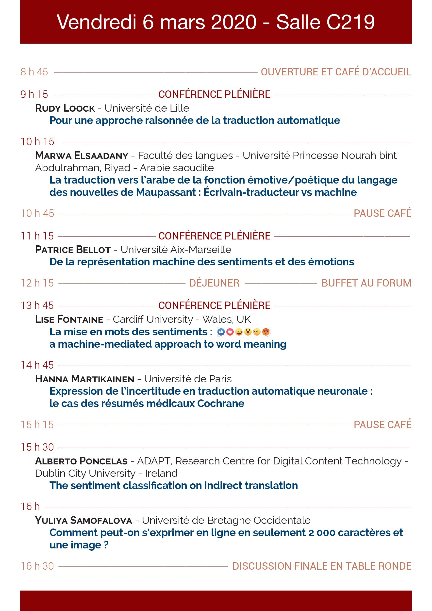

# Translation and feelings: Quel(s) sens pour la machine ?

 

[Home](https://motsmachines.github.io/2020/en) | [Call for Papers](https://motsmachines.github.io/2020/en/cfp) | [Program](https://motsmachines.github.io/2020/en/program) | [Organizers](https://motsmachines.github.io/2020/en/orga) | [Registration](https://motsmachines.github.io/2020/en/registration) | 

 

## Program

## Summaries of the conferences

* **Patrice Bellot**, De la représentation machine des sentiments et des émotions

* **Lise Fontaine**, La mise en mots des sentiments : une approche du sens des mots guidée par la machine

* **Rudy Loock**, Pour une approche raisonnée de la traduction automatique **[[summary]](sub/Loock.pdf)**

* **Hanna Martikainen**, Expression de l’incertitude en traduction automatique neuronale : le cas des résumés médicaux Cochrane

* **Alberto Poncelas**, La classification des sentiments dans la traduction indirecte

* **Yuliya Samofalova**, « Comment peut-on s’exprimer en ligne en seulement 2000 caractères et une image ? »
