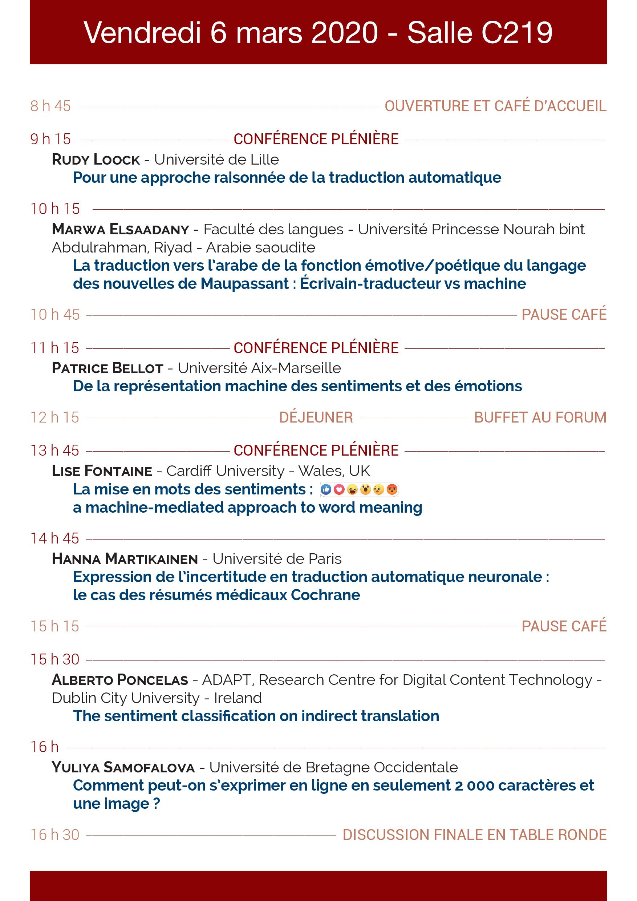

# Mots/Machines #2

 

[Home](https://motsmachines.github.io/2020/fr) | [Call for Papers](https://motsmachines.github.io/2020/fr/cfp) | [Program](https://motsmachines.github.io/2020/fr/program) | [Organizers](https://motsmachines.github.io/2020/fr/orga) | [Registration](https://motsmachines.github.io/2020/fr/registration) | 

 

## Programme

## Résumé des conférences

* **Patrice Bellot**, De la représentation machine des sentiments et des émotions **[[summary]](sub/Bellot.pdf)**

* **Lise Fontaine**, La mise en mots des sentiments : une approche du sens des mots guidée par la machine **[[summary]](sub/Fontaine.pdf)**

* **Rudy Loock**, Pour une approche raisonnée de la traduction automatique **[[summary]](sub/Loock.pdf)**

* **Hanna Martikainen**, Expression de l’incertitude en traduction automatique neuronale : le cas des résumés médicaux Cochrane **[[summary]](sub/Martikainen.pdf)**

* **Alberto Poncelas**, La classification des sentiments dans la traduction indirecte **[[summary]](sub/Poncelas.pdf)**

* **Yuliya Samofalova**, « Comment peut-on s’exprimer en ligne en seulement 2000 caractères et une image ? » **[[summary]](sub/Samofalova.pdf)**
